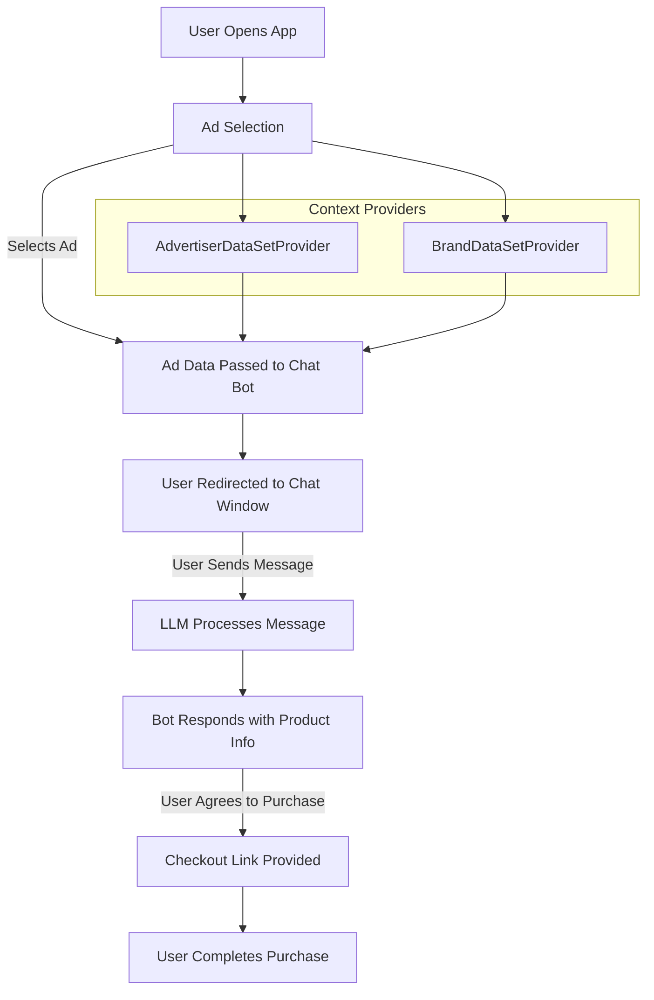

# Moshi Chat Architecture




## Ad Selection
The app loads with a list of ads, and the user can select an ad to purchase. The ad includes a caption, a checkout url, and a product image. 
We are storing the advertiser and associated brand data in state, to pass to the chat bot. 

## Chat Bot
Once the user has selected an ad, the user is redirected to the chat window. Based on the requirements, the chat is initiated by the end user. The alternative would be sending an initial message to the user, prompting the user to initiate the purchase. This follows the “opt-out” functionality seen in commerce experience, rather than having the user initially “opt-in”.

The chat bot is a simple LLM that is used to answer questions about the product. The LLM is hosted on a local Ollama instance. 


Upon the user sending the message, the message is passed into the llama2 model, with the following context: 

```
You are a helpful shopping assistant representing <the brand>.
     Be brief and concise, answering in 2 to 3 sentences.

The product being discussed is <caption> with a deal amount of <discountAmount>% off of the original price of <originalPrice>.
               The product is available in the following variants: <variants>.
               You should give the user the price of the product, the variants options, and ask if they would like to purchase the product.
               Only once the users agrees to purchase the product, give them the checkout link and ask them to click the link below to purchase the product.
               The checkout link is <checkoutUrl>
```

I made the choice to pass this in as an initial message, with a system role rather than creating a new model. I wanted each conversation to be unique tot the ad being purchased, so I wanted to pass in the context of the ad as a system message. 


## Dataset Providers

Two react context providers, one that provides the advertiser data, and one that provides the brand data. 

### AdvertiserDataSetProvider
I’ve supplemented the ad data with additional information like the checkout url, for the checkout link. The image in the checkout link preview is using the products image. I downloaded these images directly into the assets directory. This is due to the flaky shopify images. In a production environment, these images could be hosted somewhere like S3. 

Some of the data needed to be updated as well, like discountPrice as a string but not quotes. There were some mismatched keys are well like “dealPrice” and “discountPrice”. I made the assumption these were the same values.

### BrandDataSetProvider

I’ve supplemented the brand data myself, by adding the brand name and icon, from the brand’s website. This is used in the chat window navigation bar. Here is an example of the brand data:

```
{
  "brandId": "123",
  "brandName": "Brand Name",
  "brandIcon": "https://brand-icon.com/icon.png"
}
```